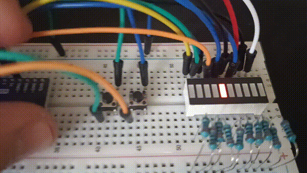

# LED-Bar Project

This is my first hardware project.

The project is an LED bar controlled by an ESP32. The LEDs create a running light animation, and two buttons can be used to change different effects in real time.

The goal of this project was to learn a bit about electronics and it is nice!

## Features:

### Running Light Animation (always)

The LEDs move across the LED bar in a smooth running animation.

### Button 1: Change Animation Width

The first button changes the width of the running light animation.
This allows me to control how many LEDs are active at the same time while the animation moves across the LED bar.

### Button 2: Brightness Control

The second button controls the brightness of the LED bar.
The system includes four different PWM brightness levels that can be switched through by pressing the button.

## Hardware Used:

- ESP32
- LED Bar
- Breadboard
- Resistors
- Jumper Wires
- 2 Push Buttons

## Software

The software was written using:

- PlatformIO in VS Code
- C++

## Demo Video

## Wire Diagramm

Alles klar — du willst keine “technischen Blocks”, sondern eine **einzige, flüssig lesbare, menschlich geschriebene Tabelle**, die man direkt so ins README kopieren kann.

Hier ist sie:

---

# 🔌 Wiring Diagram (ESP32 LED Running Light)

| Component         | Connection                 | Description                                     |
| ----------------- | -------------------------- | ----------------------------------------------- |
| LED 1             | GPIO 23 → 220Ω → LED → GND | First LED in the running sequence               |
| LED 2             | GPIO 22 → 220Ω → LED → GND | Second LED in the sequence                      |
| LED 3             | GPIO 21 → 220Ω → LED → GND | Third LED in the sequence                       |
| LED 4             | GPIO 19 → 220Ω → LED → GND | Fourth LED in the sequence                      |
| LED 5             | GPIO 18 → 220Ω → LED → GND | Fifth LED in the sequence                       |
| LED 6             | GPIO 5 → 220Ω → LED → GND  | Sixth LED in the sequence                       |
| LED 7             | GPIO 4 → 220Ω → LED → GND  | Seventh LED in the sequence                     |
| LED 8             | GPIO 0 → 220Ω → LED → GND  | Eighth LED in the sequence                      |
| LED 9             | GPIO 2 → 220Ω → LED → GND  | Ninth LED in the sequence                       |
| LED 10            | GPIO 15 → 220Ω → LED → GND | Final LED in the sequence                       |
| Brightness Button | GPIO 13 → Button → GND     | Cycles through 4 brightness levels (PWM states) |
| Width Button      | GPIO 12 → Button -> GND    | Changes how many LEDs light up at the same time |
| Power             | ESP32 USB or 5V            | Powers the entire system                        |

---

made by SimDev 🙈
